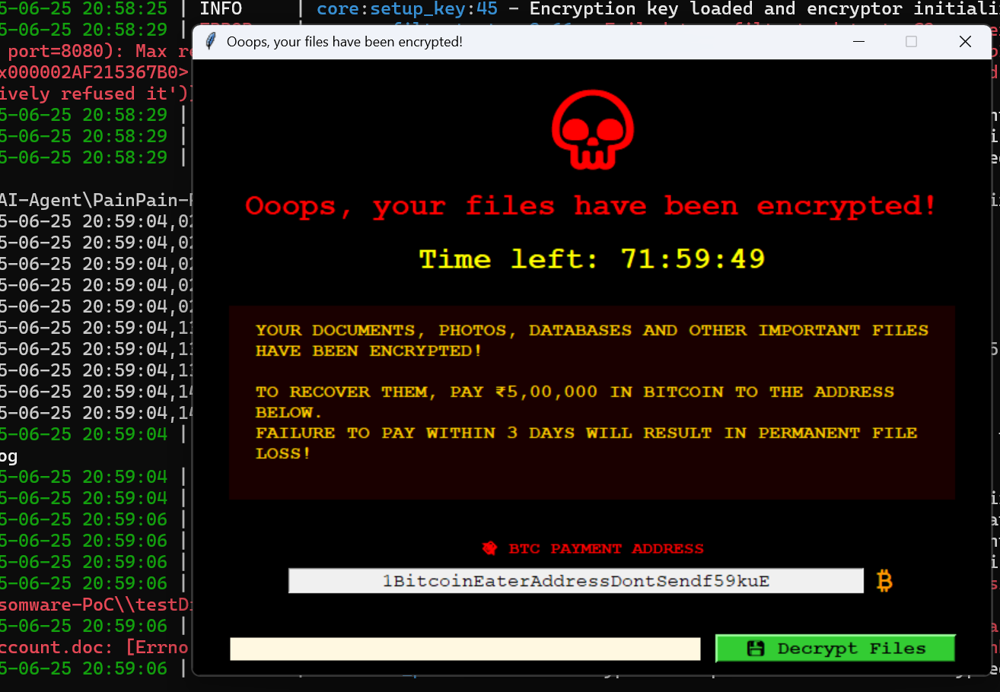

# PainPain Ransomware POC

**PainPain** is a Proof-of-Concept (PoC) ransomware project for educational and research purposes only. It demonstrates how modern ransomware can discover, encrypt, and exfiltrate files, and features a realistic, modern GUI inspired by infamous ransomware attacks.

---

## ⚠️ Disclaimer
**This project is for educational and ethical research use only.**
- Do not use this code for malicious purposes.
- The authors are not responsible for any misuse or damage caused by this project.
- Always comply with local laws and regulations.

---


<p align="center"><b>PainPain Ransomware PoC Demo</b></p>

---
## Features
- **File Discovery:** Recursively finds target files in a specified directory.
- **AES Encryption/Decryption:** Securely encrypts and decrypts files with a hardcoded key.
- **C2 Server Simulation:** Exfiltrates target directory and user info to a simulated C2 server.
- **Modern Ransomware GUI:** Displays a realistic ransom note, timer, payment instructions, and a decryption workflow.
- **Safe PoC:** Designed for controlled environments and test directories only.

---

## Usage
### 1. Install Requirements
```
pip install -r requirements.txt
```

### 2. Set Up Environment Variables
- Copy `.env.example` to `.env`:
  ```
  cp .env.example .env
  ```
- Fill in your own secrets, keys, and configuration values in `.env`.
- **Never commit your `.env` file to version control!**

### 3. Start the C2 Server
```
python c2_server_alt.py
```

### 4. Run the Ransomware PoC
- **Encrypt files:**
  ```
  python main_v2.py -p "D:\testDir" -e
  ```
- **Decrypt files:**
  ```
  python main_v2.py -p "D:\testDir" -d
  ```

### 5. GUI Interaction
- The GUI will display a ransom note, timer, and payment instructions.
- Enter the code `bitcoin` and click **Decrypt Files** to trigger decryption (for demo/testing).

---

## Project Structure
- `main_v2.py` — Main ransomware PoC script
- `wannacry_gui.py` — Modern ransomware GUI
- `c2_server/` — All C2 server code and related files
- `discover.py` — File discovery logic
- `modify.py` — File encryption/decryption logic
- `gui_main.py` — Main GUI entry point
- `__init__.py` — Package marker

## Modular Structure Update

The codebase has been refactored for modularity:

- All core logic is now in the `ransomware/` package:
  - `ransomware/discover.py`: File discovery logic
  - `ransomware/modify.py`: File modification (encryption/decryption)
  - `ransomware/gui_main.py`: Main GUI entry point (formerly `wannacry_gui.py`)
  - `ransomware/__init__.py`: Package marker

Update your imports to use the new package structure, e.g.:

```python
from ransomware import discover, modify
from ransomware.gui_main import WannaCryGUI
```

All previous functionality is preserved, but now organized for clarity and maintainability.